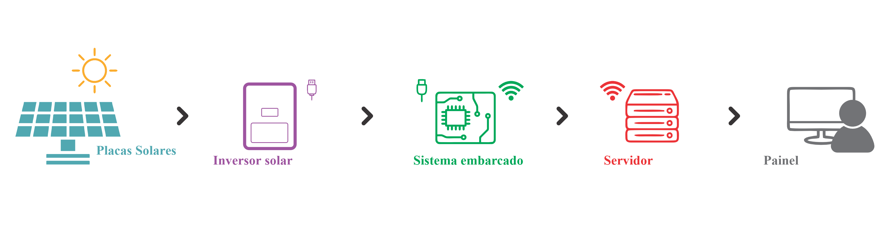

# Sistema Embarcado para a coleta de Dados de Geração Fotovoltaica para Campus Inteligente
Projeto para conclusão de curso de bacharel em engenharia de controle e automação. Elaborado em 2022.

Autor: Vitor Oliveira Moraes

Orientador: Prof. Dr. Eduardo Paciência Godoy

## Apresentação

Esse repositório contém o código utilizado para o projeto referido no título. Segue link para o [relatório](https://repositorio.unesp.br/).

A aplicação consiste no uso de um Raspberry Pie Zero W para obter as informações coletadas pelo inversor Huawei SUN2000. A comunicação entre o inversor e o sistema embarcado é feita por Modbus RTU RS485 e o envio das informações do sistema embarcado para o armazenamento dos dados utiliza o protocolo MQTT.

## Tutorial de uso

Segue o passo-a-passo básico para utilizar o código desenvolvido.

### 1) Copie o repositório

Clone o repositório para o hardware onde será instalado, levando em consideração as correções para que funcione de acordo com o presentes no [relatório](https://repositorio.unesp.br/).

`git clone https://github.com/gasiepgodoy/integracao-geracao-solar.git`

### 2) Configure as variáveis de ambiente

Para configurar as variáveis de ambiente do projeto basta copiar o arquivo "docker-compose.yml.example" e colá-lo com o nome "docker-compose.yml", modificando os campos conforme o contexto do projeto. 

### 3) Iniciando os containers 

Para iniciar os containers e a aplicação, basta utilizar as seguintes linhas de código:

`sudo docker build -t huawei-solar-rtu .`

`sudo docker compose up -d`

### 4) Configurando containers

Para garantir que o container ira reiniciar o código quando cair:

`docker run -d --restart unless-stopped huawei-solar-rtu`

Pegue o id do container pelo comando:

`docker ps`

Substitua em:

`sudo docker update --restart=always <container_id>`

## Referências

Seguem referências para a biblioteca de consulta modmus para o inversor do modelo WEG Huawei SUN2000-20KTL-M0.

 - [Solar Inverter Modbus Interface Definitions](https://javierin.com/wp-content/uploads/sites/2/2021/09/Solar-Inverter-Modbus-Interface-Definitions.pdf)
 - [HuaweiSolar por Emil Vanherp](https://gitlab.com/Emilv2/huawei-solar)
